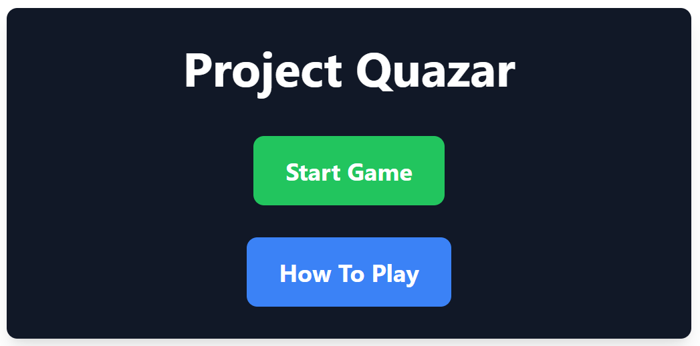
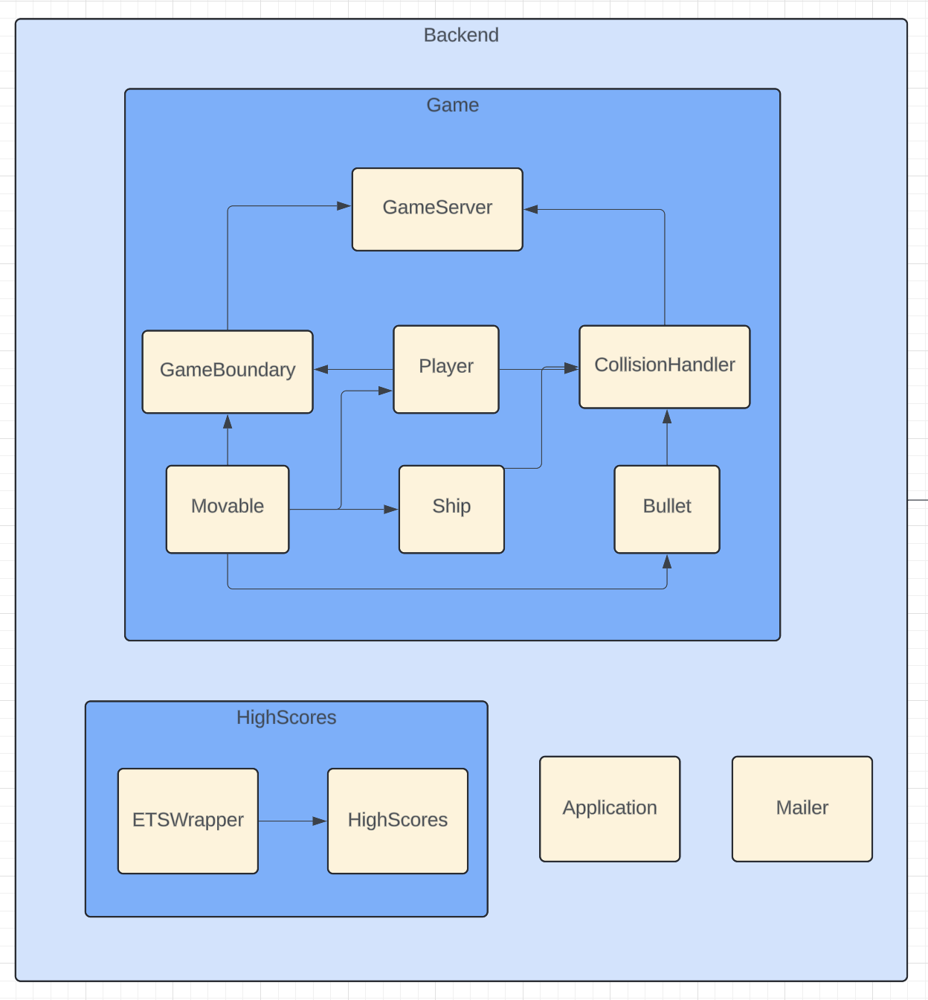
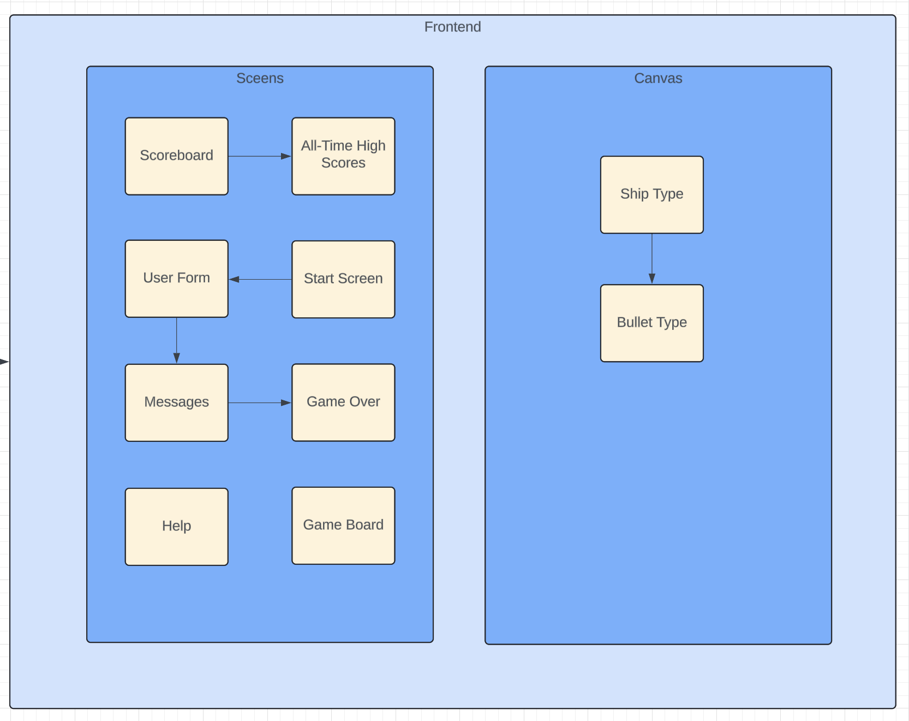

<h1 align="center"> :rocket: Project-Quazar :rocket: </h1>

Dive into the galactic world of **Project Quazar**! In this action-packed multiplayer space shooter, players face off in intense skirmishes, aiming to obliterate enemy ships and rack up points. Choose your arsenal from a variety of unique space ships and devastating bullet types that fit your combat style. Thrive in the chaos of current games and etch your name onto the leaderboards. Are you ready to claim your place among the stars in Project Quazar? Join the fray and dominate the galaxy!

  

## :book: Table of Contents

  
Table of Contents

  <ol>
    <li><a href="#about-the-project"> ➤ About The Project</a></li>
    <li><a href="#instructions"> ➤ Instructions</a></li>
    <li><a href="#overview"> ➤ Overview</a></li>
    <li><a href="#architecture"> ➤ Architecture Diagram</a></li>
    <li><a href="#management"> ➤ Management Team</a></li>
    <li><a href="#menu"> ➤ Menus Team</a></li>
    <li><a href="#backend"> ➤ Backend Team</a></li>
    <li><a href="#frontend"> ➤ Frontend Team</a></li>
    <li><a href="#setting-up-your-environments"> ➤ Setting Up Your Environment</a></li>
    <li><a href= "#future"> ➤ Future Development </a></li>
    <li><a href="#bugs"> ➤ Known Bugs</a></li>
    <li><a href="#credits"> ➤ Credits</a></li>
  </ol>

<h2 id="about-the-project"> :pencil: About The Project</h2>

**Project Quazar** is a multiplayer space shooter game designed by students in BCIT's CST Programming Paradigms Option. Built on the innovative Phoenix Framework and powered by Elixir and JavaScript, this game lets you pilot a variety of unique ships, unleash powerful bullets, and battle it out for the top spot on the leaderboard. Dive into the action and connect with other players around the globe in this galactic showdown!

<h2 id="instructions"> :video_game: User Instructions</h2>

First time piloting a space ship in **Project Quazar**? We're here to help:

### Starting the Game

1. Click **Start Game** on the main menu to begin your space adventure.

  

2. You'll be taken to a setup screen where you can personalize your gameplay:

   - **Enter your username**: Choose a unique identifier for your space hero.
   - **Choose your Ship**: Select a ship type. Each has different health and speed stats:
     - _Tank_ - High health, slow speed.
     - _Destroyer_ - Balanced health and speed.
     - _Scout_ - Low health, high speed.
   - **Choose your Bullet**: Decide on your ammunition:
     - _Heavy_ - High damage, slow speed.
     - _Medium_ - Moderate damage and speed.
     - _Light_ - Low damage, high speed.

  

3. Hit **Submit** to lock in your choices.

### In-Game Controls

- Use **WASD** keys to rotate and move your ship across the galaxy.
- Press the **Spacebar** to fire your selected ammunition at enemy ships.
- Your ship will slowly regenerate HP over time—use this to your advantage, live to fly another day!

### Game Board

- Engage in stellar dogfights on the game board.
- Your ship's health is precious! Avoid lingering in the red border, which rapidly depletes your HP.
- If you fly off the screen, it's game over!

  

### Scoreboard and Points

- Keep an eye on the scoreboard to the right to track your score and see how you stack up against the competition.

  

- Show off your sharpshooting skills! Each successful hit on an enemy ship boosts your score by the damage you deal.
- Landing the killing blow on an enemy gives you 250 points!
- Ramming into another player can be dangerous but may confirm a kill. The player with the lower health will die, but the other player takes damage equivalent to the others remaining HP. No points for the damage dealt while crashing since you pay a price as well.
- Aim true, and you may find your name etched into the high scores for all of Project Quazar to see!

Ready your thrusters and prepare for your first match in **Project Quazar**!

<h2 id="overview"> :cloud: Overview</h2>

For the development of Project Quazar, we organized our efforts into three specialized teams, each focusing on a distinct aspect of the game to ensure an engaging player experience and keeping a large group project manageable and organized.

- **Menus Team**: Tasked with crafting the first impressions, this team designed the intuitive start screen and user interfaces that players interact with throughout the game. They were also tasked with tracking the users score and displaying it in the score boards.

- **Backend Team**: The backbone of our game operations, this team handled the physics, collisions, tracking ships, their projectiles, responding to inputs, and all other functions of game logic. All that data is then shipped off to the front end to render.

- **Frontend Team**: Bringing the visual magic, this team was responsible for taking the raw data from the back end and rendering all the game elements on the screen accordingly.

Each team's dedicated efforts were seamlessly integrated into the final product, creating a cohesive and captivating gaming experience that we are proud to present to the world.

<h2 id="architecture"> :house_with_garden: Architecture Diagram </h2>

  

<h2 id="management"> 🛠️ Management Team </h2>

The people responsible for keeping the project moving forward and organized with such a large class working on the same code base. Collaborated with their respective teams to delegate tasks and determine the overall vision of the project, guiding it towards the final product.

- Mike Susut: Project Manager and Game Design / Balance
- Olga Zimina: Backend Manager
- Sean Sollestre: Frontend Manager
- Rhys Mahannah: Menus Manager

<h2 id="menu"> :page_with_curl: Menus Team</h2>

The Menus team was responsible for creating the following:

- **Start Screen**: Includes the Play and High Scores buttons
- **Create Ship Screen**: Where players name their ship, select a ship type, and select a weapon type
- **In-Game High Scores Screen** : Displays the scores of all players in the current game, from highest to lowest
- **All-Time High Scores Screen** : Displays the scores of all players who have ever played the game, from highest to lowest

## Team Members

- Amarjot Sangha
- Carson Olafson
- Ediljohn Joson
- Rhys Mahannah

<h2 id="backend"> :fax: Backend Team</h2>

The Backend team was responsible for creating the following:

- **Bullet**: Handles all bullet-related operations
- **CollisionHandler**: Handles collision detection between game entities (bullet/player/ship)
- **GameBoundary**: Handles boundary collision logic
- **GameServer**: Contains the main game logic
- **Movable**: Handles an object's position/velocity/direction
- **Player**: Stores all player-related functionality
- **Ship**: Contains all ship-related functionality
- **ETSWrapper**: Uses ETS operations for high scores
- **HighScores**: Manages high scores
- **Application**: the entry point, sets up supervision trees
- **Mailer**: Handles email-sending capabilities within the application

## Team Members

- Olga Zimina
- Dakaro Mueller
- Abhishek Chouhan
- Alex Sichitiu
- Shawn Birring
- Mikko Sio
- Michelle Kwok

<h2 id="frontend"> :tv: Frontend Team</h2>

The Frontend team was responsible for creating the following:

### Design Elements

- **Design Bullets**

  - Create bullet assets.
  - Render bullets on screen.
  - Handle bullet movement dynamics.

- **Design Player**

  - Create player ship asset.
  - Render player ship and health bar on screen.
  - Display player's name.
  - Manage player ship movement.

- **Design Game Board**
  - Create assets for the game board.
  - Set up boundaries for the game board.
  - Render the game board.

### Multiplayer Features

- **Multiplayer**: Implement rendering processes for multiplayer interactions.

### Core Components

- **Components**: Define and manage interactive components essential for gameplay.

- **Render Canvas**: Set up and manage the canvas where the game elements are rendered.

- **PubSub System**: Implement a Publish-Subscribe system to handle event-driven interactions within the game.

## Team Members

- Sean Sollestre
- Aditya Agrawai
- Josh Chuah
- Jason Shi
- Shuyi Liu
- Emily Tran
- Daniel Okonov

<h2 id="setting-up-your-environments"> :wrench: Setting Up Your Environment</h2>

### (1) Clone the Repository

- Open **VS Code**
- Press `Ctrl+Shift+P` (or `Cmd+Shift+P` on macOS) to open the Command Palette.
- Type `Git: Clone` and select the option.
- Paste the project URL: `https://github.com/MikeSusutZZ/Project-Quazar.git` and hit `Enter`.
- When prompted, select `Open` to open the cloned repository.

### (2) Install Dependencies

- Right-click on `project_quazar` in the Explorer sidebar and select `Open in Integrated Terminal`
- Run the following command in the terminal: `mix deps.get`

### (3) Start the Phoenix Server

- In the integrated terminal, start your server with: `mix phx.server`
- Visit `localhost:4000` in your browser to see the application.

- 

<h2 id="future"> 🎆 Future Development </h2>
BCIT is very busy, and even with 19 students working together, there's only much we can get done. So that begs the question, what would have we been able to complete with more time to focus on Project Quazar?

### User Login, Accounts, Authenication
Use Phoenix's built in ecto system to have users log into profiles where they can have a username unique to them, track their score history, and save their favorite ship builds

### Bigger Scrren, Camera Following, and Obstacles
We've only got 19 people, so we were content with an 800x800 screen to prototype on and a top down view of the whole map, but given the time we would have the camera focused in on the player, keeping them in the center of the screen and moving everything else around it. Having the camera work this way would mean we can have a larger overall board, allowing for more players, and allowing for the possibility of obstacles such as asteroids and black holes.

### More Customization
The 3 ship types and 3 weapon types allows for 9 different combinations for players to find their optimal play style, but in the future there could be more stats and more options to tune the way you want to play. Extra weapon types such as homing missles and mines would be some of the first on the list

<h2 id="bugs"> 🐛 Known Bugs</h2>

### Don't AutoFill

If you allow google to autofill your username, you will get kicked back to the home screen and be repeatedly kicked back whenever you try to type. Do not use autofill. If you have, solve the bug with a hard cache reload (ctrl + F5).

### Ungraceful Exits Hogging Usernames

If a player leaves the game page any way other than dying, they remain in the ets table and so their username cannot be used until server reload

### Browser Support

Use Chrome for best results, Safari has been particularly inconsistent.

### Since Last Reload High Scores

While labelled as "All Time High Scores" it only saves since the last time the server is closed as it uses an ets table

### Long asset load time and heavy data load

This project sends a LOT of information very quickly. Do not use a metered connection. Players may join the game before having all assets load, allowing them to be killed before they finish loading.

<h2 id="credits"> :pray: Credits</h2>

We would like to thank everyone in our class for contributing to this awesome project. It was a blast working with all of you. All the all-nighters, the debugging, the laughter, and the frustration were worth it in the end. We hope you enjoy playing Project Quazar as much as we enjoyed making it! :rocket:

To Albert, our instructor, thank you for making us work on a 19-person project. It was a challenge with all the merge conflicts, but we learned a lot and had fun along the way.
